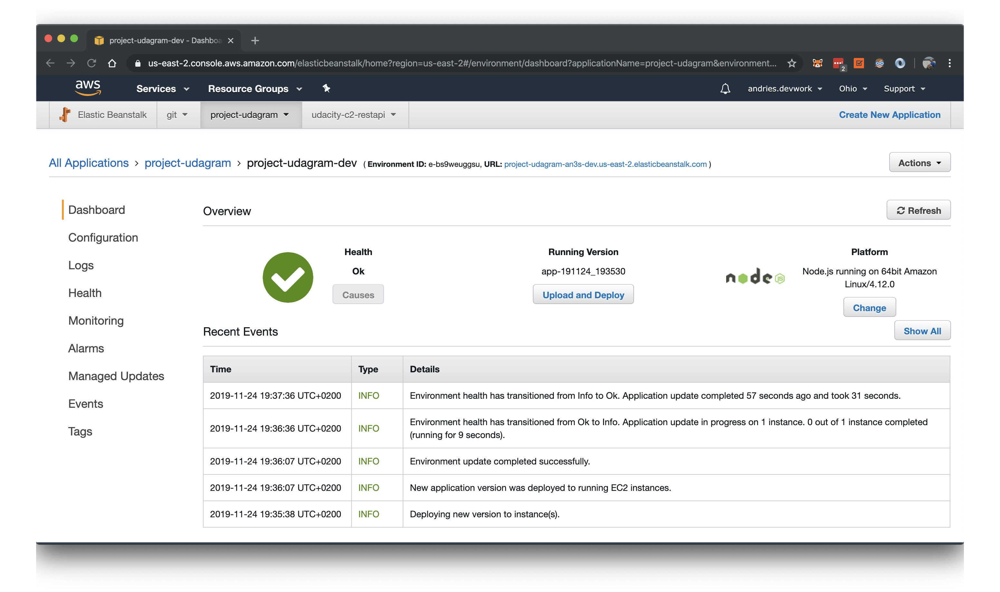
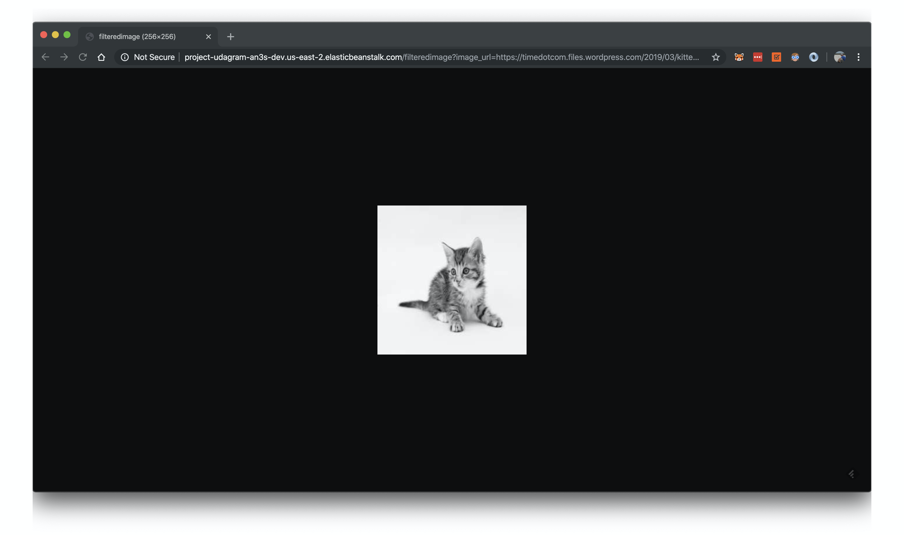

# Submission details

The Elastic Beanstalk deployment is: <http://project-udagram-an3s-dev.us-east-2.elasticbeanstalk.com/>

## Test Endpoints

To test the endpoints more easily, a [Postman collection](../cloud-cdnd-c2-final.postman_collection.json) was stored with the following endpoints (and tests).

| Description | Endpoint |
|---|---|
| Root endpoint | [/](http://project-udagram-an3s-dev.us-east-2.elasticbeanstalk.com/) |
| Valid image url | [/filteredimage?image_url=https://timedotcom.files.wordpress.com/2019/03/kitten-report.jpg](http://project-udagram-an3s-dev.us-east-2.elasticbeanstalk.com/filteredimage?image_url=https://timedotcom.files.wordpress.com/2019/03/kitten-report.jpg) |
| Invalid image url | [/filteredimage?image_url=not_a_url](http://project-udagram-an3s-dev.us-east-2.elasticbeanstalk.com/filteredimage?image_url=not_a_url) |
| Unspecified image url | [/filteredimage](http://project-udagram-an3s-dev.us-east-2.elasticbeanstalk.com/filteredimage) |

## Screenshots

